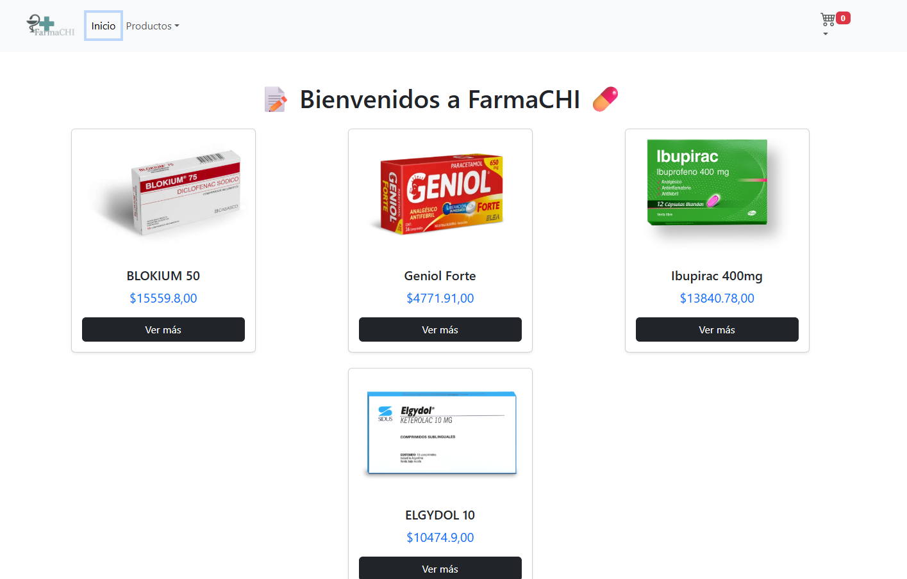

# 🛒 Entrega Final Marcos Chiesa - Coderhouse ReactJS - Comisión 69600

## 💊 Proyecto - Farmachi

*Este proyecto fue realizado como entrega final de un Marketplace de farmacia y aprendizaje sobre ReactJS.*

## 🖼️ Vista previa de la aplicación



## 📲 Dependencias / Librerias utilizadas:

* **[Node.js](https://nodejs.org/)**

  Plataforma para ejecutar JavaScript del lado del servidor. Es necesario para correr y compilar proyectos como Vite.
* **[ReactJS (Vite)]()**

  Herramienta moderna de build para proyectos con React. Mucho más rápida que Create React App.
* **[Firebase Firestore]()**

  Base de datos en tiempo real y escalable. La documentación te guía para integrarlo con React.
* **[React-Bootstrap]()**

  Librería de componentes Bootstrap adaptada para React. Fácil de usar y muy visual. (Y super popular 🤣)
* **[React Router]()**

  Librería de rutas para React, esencial para manejar navegación y rutas dinámicas (como `/category/:id` o `/item/:id`).
* **[SweetAlert2]()**

  Librería para mostrar alertas personalizadas, animadas y elegantes en JavaScript (y por supuesto, en React). Ideal para confirmaciones, errores, formularios emergentes, etc.
* **[React Hot Toast](https://react-hot-toast.com/)**

  Librería simple, rápida y hermosa para mostrar notificaciones tipo "toast" en apps React. Muy útil para mostrar confirmaciones, errores, alertas, etc.
* **[React Hook Form](https://react-hook-form.com/)**

  Librería liviana y performante para manejar formularios en React, con validaciones simples o avanzadas.

## 📝 Instalación:

1. Clone el repositorio
2. Utilice el siguiente comando para pararse dentro del proyecto `'cd farmachi'`
3. Instale las dendencias con el siguiente comando
   ```
   'npm install'
   ```
4. Para que funcione de forma local ejecutre el comando:
   ```
    'npm run dev'
   ```

## 💻 Recomendamos Hosteo en

* Vercel
* Para ver online el proyecto: [https://proyecto-final-chiesa-marcos.vercel.app/]()

#### Desarrollado por el Dr. Chiche
